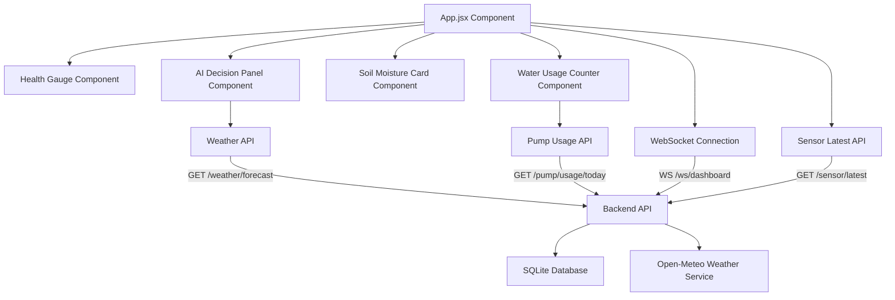
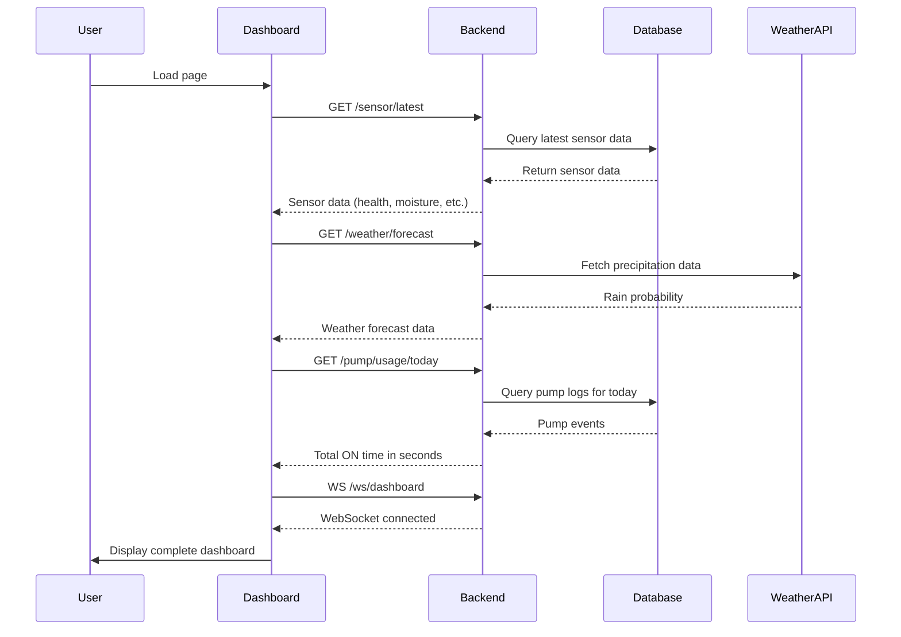
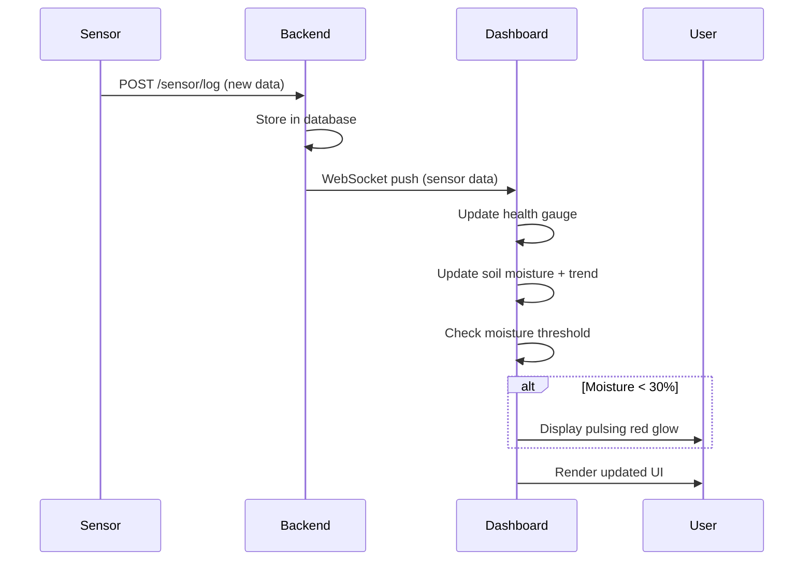
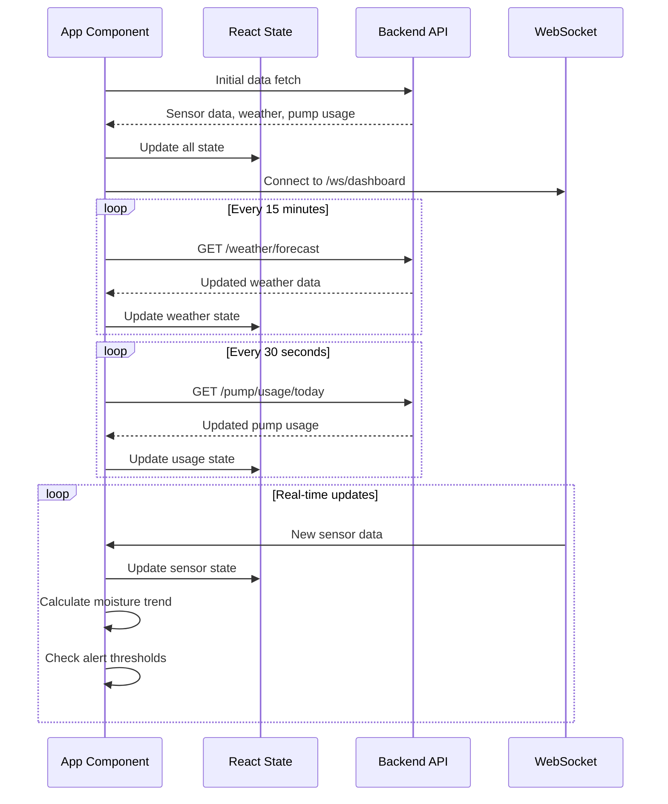

# Design Document: AgroMind Dashboard Improvements

## Overview

This design enhances the AgroMind AI smart agriculture monitoring dashboard with four key improvements: a 270-degree arc speedometer-style health gauge, weather forecast integration in the AI decision panel, enhanced soil moisture alerts with trend indicators, and a water usage counter tracking daily pump runtime. The improvements maintain the existing UI structure while adding critical real-time monitoring capabilities for agricultural decision-making. The dashboard uses React with Vite and Tailwind CSS, integrating with a Python FastAPI backend at localhost:8000.

## Architecture



## Sequence Diagrams

### Dashboard Initialization Flow



### Real-Time Update Flow




## Components and Interfaces

### Component 1: HealthGauge

**Purpose**: Display crop health score as a 270-degree arc speedometer that fills clockwise from 0 to 100.

**Interface**:
```typescript
interface HealthGaugeProps {
  healthScore: number  // 0-100
  size?: number        // diameter in pixels, default 200
}
```

**Responsibilities**:
- Render SVG-based 270-degree arc (from -135° to +135°)
- Fill arc clockwise based on health score percentage
- Display numeric health score in center
- Use color gradient: red (0-30), yellow (30-70), green (70-100)
- Animate arc fill on value changes

**Visual Specifications**:
- Arc starts at bottom-left (-135°), ends at bottom-right (+135°)
- Background arc: light gray (#e5e7eb)
- Foreground arc: dynamic color based on score
- Center text: large bold font showing score + "%"
- Stroke width: 20px for clear visibility

---

### Component 2: AIDecisionPanel (Enhanced)

**Purpose**: Display AI-generated farming decisions with integrated weather forecast.

**Interface**:
```typescript
interface AIDecisionPanelProps {
  decision: string
  reason: string
  nextCheckMinutes: number
}

interface WeatherForecast {
  rain_probability_next_hour: number
  rain_expected: boolean
  error?: string
}
```

**Responsibilities**:
- Display existing AI decision and reasoning
- Fetch weather forecast from backend API
- Show rain probability with emoji indicator
- Refresh weather data every 15 minutes
- Handle API errors gracefully with fallback display

**API Integration**:
- Endpoint: `GET http://localhost:8000/weather/forecast`
- Response format: `{ rain_probability_next_hour: number, rain_expected: boolean }`
- Display format: "🌧️ Rain probability: X% next hour"

---

### Component 3: SoilMoistureCard (Enhanced)

**Purpose**: Display soil moisture level with visual alerts and trend indicators.

**Interface**:
```typescript
interface SoilMoistureCardProps {
  currentMoisture: number    // current reading (0-100)
  previousMoisture?: number  // previous reading for trend calculation
  timestamp: string
}

type TrendDirection = 'up' | 'down' | 'stable'
```

**Responsibilities**:
- Display current soil moisture percentage
- Calculate trend vs previous reading (threshold: ±2%)
- Show trend arrow: ↑ (increasing), ↓ (decreasing), → (stable)
- Apply pulsing red glow animation when moisture < 30%
- Maintain existing card styling and layout

**Alert Logic**:
- Critical threshold: moisture < 30%
- Visual indicator: red border with pulsing glow animation
- Animation: CSS keyframe with box-shadow pulse (1.5s cycle)

**Trend Calculation**:
- Up: current > previous + 2%
- Down: current < previous - 2%
- Stable: within ±2% range

---

### Component 4: WaterUsageCounter

**Purpose**: Display total pump ON time for the current day.

**Interface**:
```typescript
interface WaterUsageCounterProps {
  position: 'below-pump-button'  // placement constraint
}

interface PumpUsageResponse {
  date: string
  total_on_seconds: number
  events: Array<{
    id: number
    ts: string
    action: string
    duration_sec: number
  }>
}
```

**Responsibilities**:
- Fetch daily pump usage from backend API
- Convert seconds to minutes for display
- Position below pump control button
- Refresh data every 30 seconds
- Show loading state during fetch

**API Integration**:
- Endpoint: `GET http://localhost:8000/pump/usage/today`
- Response: `{ date: string, total_on_seconds: number, events: [] }`
- Display format: "💧 Water used today: X minutes"

---

## Data Models

### Model 1: SensorData

```typescript
interface SensorData {
  id: number
  ts: string
  soil_moisture: number
  temperature: number
  humidity: number
  rain_expected: boolean
  decision: string
  reason: string
  health_score: number
  next_check_minutes: number
}
```

**Validation Rules**:
- soil_moisture: 0-100 (percentage)
- temperature: -50 to 60 (Celsius)
- humidity: 0-100 (percentage)
- health_score: 0-100 (percentage)
- next_check_minutes: positive integer

---

### Model 2: WeatherForecast

```typescript
interface WeatherForecast {
  rain_probability_next_hour: number  // 0-100
  rain_expected: boolean              // true if > 50%
  error?: string                      // optional error message
}
```

**Validation Rules**:
- rain_probability_next_hour: 0-100 (percentage)
- rain_expected: derived from probability > 50

---

### Model 3: PumpUsage

```typescript
interface PumpUsage {
  date: string              // ISO date format
  total_on_seconds: number  // sum of all ON durations
  events: PumpEvent[]
}

interface PumpEvent {
  id: number
  ts: string       // ISO timestamp
  action: string   // "ON" or "OFF"
  duration_sec: number
}
```

**Validation Rules**:
- date: valid ISO date string (YYYY-MM-DD)
- total_on_seconds: non-negative integer
- action: must be "ON" or "OFF"
- duration_sec: non-negative integer

---


## Main Algorithm/Workflow



## Algorithmic Pseudocode

### Main Dashboard Initialization Algorithm

```pascal
ALGORITHM initializeDashboard()
INPUT: None
OUTPUT: Initialized dashboard state

BEGIN
  // Step 1: Initialize state variables
  sensorData ← NULL
  weatherData ← NULL
  pumpUsage ← NULL
  previousMoisture ← NULL
  wsConnection ← NULL
  
  // Step 2: Fetch initial data in parallel
  PARALLEL_EXECUTE
    sensorData ← fetchSensorLatest()
    weatherData ← fetchWeatherForecast()
    pumpUsage ← fetchPumpUsage()
  END_PARALLEL
  
  // Step 3: Establish WebSocket connection
  wsConnection ← connectWebSocket("ws://localhost:8000/ws/dashboard")
  
  // Step 4: Set up periodic refresh timers
  weatherTimer ← setInterval(fetchWeatherForecast, 15 * 60 * 1000)  // 15 minutes
  pumpTimer ← setInterval(fetchPumpUsage, 30 * 1000)  // 30 seconds
  
  // Step 5: Register WebSocket message handler
  wsConnection.onMessage(handleSensorUpdate)
  
  RETURN {sensorData, weatherData, pumpUsage, wsConnection}
END
```

**Preconditions**:
- Backend API is running at localhost:8000
- Network connectivity is available
- WebSocket endpoint is accessible

**Postconditions**:
- All initial data is fetched and stored in state
- WebSocket connection is established
- Periodic refresh timers are active
- Dashboard is ready to display data

---

### Weather Forecast Fetch Algorithm

```pascal
ALGORITHM fetchWeatherForecast()
INPUT: None
OUTPUT: WeatherForecast object

BEGIN
  TRY
    response ← HTTP_GET("http://localhost:8000/weather/forecast")
    
    IF response.status ≠ 200 THEN
      RETURN {rain_probability_next_hour: 0, rain_expected: false, error: "API error"}
    END IF
    
    data ← parseJSON(response.body)
    
    // Validate response structure
    IF NOT hasProperty(data, "rain_probability_next_hour") THEN
      RETURN {rain_probability_next_hour: 0, rain_expected: false, error: "Invalid response"}
    END IF
    
    RETURN data
    
  CATCH error
    RETURN {rain_probability_next_hour: 0, rain_expected: false, error: error.message}
  END_TRY
END
```

**Preconditions**:
- Backend API endpoint /weather/forecast exists
- Network connection is available

**Postconditions**:
- Returns valid WeatherForecast object
- On error, returns safe default values with error message
- No exceptions propagate to caller

---

### Soil Moisture Trend Calculation Algorithm

```pascal
ALGORITHM calculateMoistureTrend(current, previous)
INPUT: current (number), previous (number or NULL)
OUTPUT: TrendDirection ('up', 'down', or 'stable')

BEGIN
  ASSERT current ≥ 0 AND current ≤ 100
  
  // Handle first reading case
  IF previous = NULL THEN
    RETURN 'stable'
  END IF
  
  ASSERT previous ≥ 0 AND previous ≤ 100
  
  difference ← current - previous
  THRESHOLD ← 2.0
  
  IF difference > THRESHOLD THEN
    RETURN 'up'
  ELSE IF difference < -THRESHOLD THEN
    RETURN 'down'
  ELSE
    RETURN 'stable'
  END IF
END
```

**Preconditions**:
- current is a valid moisture percentage (0-100)
- previous is either NULL or a valid moisture percentage (0-100)

**Postconditions**:
- Returns one of three trend directions: 'up', 'down', or 'stable'
- Trend is 'stable' if difference is within ±2%
- First reading always returns 'stable'

**Loop Invariants**: N/A (no loops)

---

### Health Gauge Arc Rendering Algorithm

```pascal
ALGORITHM renderHealthGaugeArc(healthScore, size)
INPUT: healthScore (0-100), size (diameter in pixels)
OUTPUT: SVG arc path string

BEGIN
  ASSERT healthScore ≥ 0 AND healthScore ≤ 100
  ASSERT size > 0
  
  // Step 1: Calculate arc parameters
  centerX ← size / 2
  centerY ← size / 2
  radius ← (size / 2) - 20  // Account for stroke width
  
  startAngle ← -135  // degrees (bottom-left)
  endAngle ← 135     // degrees (bottom-right)
  totalArcDegrees ← endAngle - startAngle  // 270 degrees
  
  // Step 2: Calculate fill angle based on health score
  fillDegrees ← (healthScore / 100) * totalArcDegrees
  currentAngle ← startAngle + fillDegrees
  
  // Step 3: Convert angles to radians
  startRad ← degreesToRadians(startAngle)
  currentRad ← degreesToRadians(currentAngle)
  
  // Step 4: Calculate arc endpoints
  startX ← centerX + radius * cos(startRad)
  startY ← centerY + radius * sin(startRad)
  endX ← centerX + radius * cos(currentRad)
  endY ← centerY + radius * sin(currentRad)
  
  // Step 5: Determine large arc flag
  largeArcFlag ← IF fillDegrees > 180 THEN 1 ELSE 0
  
  // Step 6: Build SVG path
  path ← "M " + startX + " " + startY +
         " A " + radius + " " + radius + " 0 " + largeArcFlag + " 1 " + endX + " " + endY
  
  RETURN path
END
```

**Preconditions**:
- healthScore is between 0 and 100 (inclusive)
- size is a positive number representing diameter in pixels
- SVG rendering context is available

**Postconditions**:
- Returns valid SVG path string for arc
- Arc starts at -135° and fills clockwise
- Arc length is proportional to health score
- Path is renderable in SVG context

**Loop Invariants**: N/A (no loops)

---

### Pump Usage Conversion Algorithm

```pascal
ALGORITHM convertPumpUsageToMinutes(totalSeconds)
INPUT: totalSeconds (non-negative integer)
OUTPUT: formatted string with minutes

BEGIN
  ASSERT totalSeconds ≥ 0
  
  minutes ← floor(totalSeconds / 60)
  remainingSeconds ← totalSeconds MOD 60
  
  IF remainingSeconds ≥ 30 THEN
    minutes ← minutes + 1  // Round up if >= 30 seconds
  END IF
  
  RETURN minutes + " minutes"
END
```

**Preconditions**:
- totalSeconds is a non-negative integer

**Postconditions**:
- Returns formatted string with rounded minutes
- Rounds up if remaining seconds >= 30
- Always returns non-negative value

**Loop Invariants**: N/A (no loops)

---

### WebSocket Message Handler Algorithm

```pascal
ALGORITHM handleSensorUpdate(message)
INPUT: message (WebSocket message object)
OUTPUT: Updated application state

BEGIN
  TRY
    // Step 1: Parse incoming message
    data ← parseJSON(message.data)
    
    // Step 2: Validate message structure
    IF NOT isValidSensorData(data) THEN
      RETURN  // Ignore invalid messages
    END IF
    
    // Step 3: Store previous moisture for trend calculation
    previousMoisture ← currentState.sensorData.soil_moisture
    
    // Step 4: Update sensor data state
    updateState({sensorData: data})
    
    // Step 5: Calculate and update moisture trend
    trend ← calculateMoistureTrend(data.soil_moisture, previousMoisture)
    updateState({moistureTrend: trend})
    
    // Step 6: Check alert conditions
    IF data.soil_moisture < 30 THEN
      updateState({showMoistureAlert: true})
    ELSE
      updateState({showMoistureAlert: false})
    END IF
    
  CATCH error
    logError("WebSocket message handling failed", error)
    // Continue operation, don't crash dashboard
  END_TRY
END
```

**Preconditions**:
- WebSocket connection is established
- message contains valid JSON data
- Application state is initialized

**Postconditions**:
- Sensor data state is updated with new values
- Moisture trend is calculated and stored
- Alert state is updated based on threshold
- Errors are logged but don't crash the application

**Loop Invariants**: N/A (no loops)

---


## Key Functions with Formal Specifications

### Function 1: useWeatherForecast()

```typescript
function useWeatherForecast(): {
  weather: WeatherForecast | null
  loading: boolean
  error: string | null
}
```

**Preconditions**:
- React component is mounted
- Backend API is accessible at localhost:8000

**Postconditions**:
- Returns weather forecast data or null if not yet loaded
- Automatically refreshes every 15 minutes
- Returns loading state during fetch operations
- Returns error state if fetch fails
- Cleanup function cancels timers on unmount

**Loop Invariants**: 
- Refresh timer maintains 15-minute interval throughout component lifecycle
- Only one fetch operation is active at any time

---

### Function 2: usePumpUsage()

```typescript
function usePumpUsage(): {
  usage: PumpUsage | null
  loading: boolean
  error: string | null
}
```

**Preconditions**:
- React component is mounted
- Backend API endpoint /pump/usage/today exists

**Postconditions**:
- Returns pump usage data or null if not yet loaded
- Automatically refreshes every 30 seconds
- Returns loading state during fetch operations
- Returns error state if fetch fails
- Cleanup function cancels timers on unmount

**Loop Invariants**:
- Refresh timer maintains 30-second interval throughout component lifecycle
- Only one fetch operation is active at any time

---

### Function 3: useWebSocket()

```typescript
function useWebSocket(url: string): {
  data: SensorData | null
  connected: boolean
  error: string | null
}
```

**Preconditions**:
- url is a valid WebSocket URL
- WebSocket server is running and accessible

**Postconditions**:
- Establishes WebSocket connection on mount
- Returns latest sensor data received via WebSocket
- Returns connection status (connected/disconnected)
- Automatically reconnects on connection loss
- Cleanup function closes connection on unmount

**Loop Invariants**:
- Connection state remains consistent with actual WebSocket state
- Message handler processes messages in order received

---

### Function 4: calculateTrendArrow()

```typescript
function calculateTrendArrow(
  current: number,
  previous: number | null
): '↑' | '↓' | '→'
```

**Preconditions**:
- current is a valid number between 0 and 100
- previous is either null or a valid number between 0 and 100

**Postconditions**:
- Returns '↑' if current > previous + 2
- Returns '↓' if current < previous - 2
- Returns '→' if difference is within ±2 or previous is null
- No side effects on input parameters

**Loop Invariants**: N/A (no loops)

---

### Function 5: getHealthColor()

```typescript
function getHealthColor(score: number): string
```

**Preconditions**:
- score is a number between 0 and 100

**Postconditions**:
- Returns '#ef4444' (red) if score < 30
- Returns '#eab308' (yellow) if score >= 30 and < 70
- Returns '#22c55e' (green) if score >= 70
- Always returns a valid hex color string

**Loop Invariants**: N/A (no loops)

---

### Function 6: polarToCartesian()

```typescript
function polarToCartesian(
  centerX: number,
  centerY: number,
  radius: number,
  angleInDegrees: number
): { x: number, y: number }
```

**Preconditions**:
- centerX, centerY, radius are valid numbers
- radius is positive
- angleInDegrees is a number (can be any value)

**Postconditions**:
- Returns cartesian coordinates (x, y) for the given polar coordinates
- x = centerX + radius * cos(angleInRadians)
- y = centerY + radius * sin(angleInRadians)
- No side effects on input parameters

**Loop Invariants**: N/A (no loops)

---

### Function 7: describeArc()

```typescript
function describeArc(
  x: number,
  y: number,
  radius: number,
  startAngle: number,
  endAngle: number
): string
```

**Preconditions**:
- x, y are center coordinates (valid numbers)
- radius is a positive number
- startAngle and endAngle are in degrees
- endAngle > startAngle

**Postconditions**:
- Returns valid SVG path string for arc
- Arc is drawn clockwise from startAngle to endAngle
- Uses large-arc-flag correctly for arcs > 180°
- Path is renderable in SVG context

**Loop Invariants**: N/A (no loops)

---

## Example Usage

### Example 1: Health Gauge Component

```typescript
import { HealthGauge } from './components/HealthGauge'

function Dashboard() {
  const [sensorData, setSensorData] = useState(null)
  
  return (
    <div className="dashboard">
      <HealthGauge 
        healthScore={sensorData?.health_score || 0}
        size={200}
      />
    </div>
  )
}
```

### Example 2: Weather Forecast Integration

```typescript
import { useWeatherForecast } from './hooks/useWeatherForecast'

function AIDecisionPanel({ decision, reason }) {
  const { weather, loading, error } = useWeatherForecast()
  
  return (
    <div className="ai-panel">
      <h3>AI Decision</h3>
      <p>{decision}</p>
      <p>{reason}</p>
      
      {loading && <p>Loading weather...</p>}
      {error && <p>Weather unavailable</p>}
      {weather && (
        <p>🌧️ Rain probability: {weather.rain_probability_next_hour}% next hour</p>
      )}
    </div>
  )
}
```

### Example 3: Soil Moisture with Alert

```typescript
import { calculateTrendArrow } from './utils/trends'

function SoilMoistureCard({ current, previous }) {
  const trend = calculateTrendArrow(current, previous)
  const isLow = current < 30
  
  return (
    <div className={`moisture-card ${isLow ? 'alert-glow' : ''}`}>
      <h3>Soil Moisture</h3>
      <p className="text-4xl">{current}% {trend}</p>
    </div>
  )
}

// CSS for pulsing glow
// .alert-glow {
//   animation: pulse-glow 1.5s ease-in-out infinite;
//   border: 2px solid #ef4444;
// }
// @keyframes pulse-glow {
//   0%, 100% { box-shadow: 0 0 5px #ef4444; }
//   50% { box-shadow: 0 0 20px #ef4444; }
// }
```

### Example 4: Water Usage Counter

```typescript
import { usePumpUsage } from './hooks/usePumpUsage'

function WaterUsageCounter() {
  const { usage, loading } = usePumpUsage()
  
  const minutes = usage 
    ? Math.round(usage.total_on_seconds / 60)
    : 0
  
  return (
    <div className="water-usage">
      {loading ? (
        <p>Loading...</p>
      ) : (
        <p>💧 Water used today: {minutes} minutes</p>
      )}
    </div>
  )
}
```

### Example 5: Complete Dashboard Integration

```typescript
import { useState, useEffect } from 'react'
import { HealthGauge } from './components/HealthGauge'
import { AIDecisionPanel } from './components/AIDecisionPanel'
import { SoilMoistureCard } from './components/SoilMoistureCard'
import { WaterUsageCounter } from './components/WaterUsageCounter'
import { useWebSocket } from './hooks/useWebSocket'

function App() {
  const [sensorData, setSensorData] = useState(null)
  const [previousMoisture, setPreviousMoisture] = useState(null)
  const { data: wsData } = useWebSocket('ws://localhost:8000/ws/dashboard')
  
  // Fetch initial data
  useEffect(() => {
    fetch('http://localhost:8000/sensor/latest')
      .then(res => res.json())
      .then(data => setSensorData(data))
  }, [])
  
  // Update from WebSocket
  useEffect(() => {
    if (wsData) {
      setPreviousMoisture(sensorData?.soil_moisture || null)
      setSensorData(wsData)
    }
  }, [wsData])
  
  if (!sensorData) return <div>Loading...</div>
  
  return (
    <div className="dashboard-grid">
      <HealthGauge healthScore={sensorData.health_score} />
      
      <AIDecisionPanel 
        decision={sensorData.decision}
        reason={sensorData.reason}
      />
      
      <SoilMoistureCard 
        current={sensorData.soil_moisture}
        previous={previousMoisture}
      />
      
      <div className="pump-section">
        <button className="pump-button">Toggle Pump</button>
        <WaterUsageCounter />
      </div>
    </div>
  )
}
```

---


## Correctness Properties

### Property 1: Health Gauge Arc Rendering

**Universal Quantification**:
```
∀ healthScore ∈ [0, 100], size > 0:
  arcLength(renderHealthGaugeArc(healthScore, size)) = (healthScore / 100) × 270°
```

**Description**: The health gauge arc length is always proportional to the health score, filling exactly (score/100) of the 270-degree arc.

---

### Property 2: Moisture Trend Consistency

**Universal Quantification**:
```
∀ current, previous ∈ [0, 100]:
  (current - previous > 2) ⟹ calculateTrendArrow(current, previous) = '↑'
  ∧ (current - previous < -2) ⟹ calculateTrendArrow(current, previous) = '↓'
  ∧ (|current - previous| ≤ 2) ⟹ calculateTrendArrow(current, previous) = '→'
```

**Description**: Trend arrows accurately reflect moisture changes with a 2% threshold for stability.

---

### Property 3: Alert Threshold Accuracy

**Universal Quantification**:
```
∀ moisture ∈ [0, 100]:
  (moisture < 30) ⟺ showMoistureAlert = true
```

**Description**: The moisture alert is shown if and only if the moisture level is below 30%.

---

### Property 4: Weather Data Freshness

**Universal Quantification**:
```
∀ t (time):
  weatherDataAge(t) ≤ 15 minutes
```

**Description**: Weather forecast data is never older than 15 minutes due to automatic refresh.

---

### Property 5: Pump Usage Accuracy

**Universal Quantification**:
```
∀ pumpEvents ∈ PumpEvent[]:
  totalOnTime = Σ(event.duration_sec | event.action = "ON")
```

**Description**: Total pump ON time equals the sum of all ON event durations for the current day.

---

### Property 6: WebSocket Data Integrity

**Universal Quantification**:
```
∀ message received via WebSocket:
  isValidSensorData(message) ⟹ updateState(message)
  ∧ ¬isValidSensorData(message) ⟹ ignoreMessage(message)
```

**Description**: Only valid sensor data messages update the application state; invalid messages are ignored.

---

### Property 7: Color Mapping Correctness

**Universal Quantification**:
```
∀ score ∈ [0, 100]:
  (score < 30) ⟹ getHealthColor(score) = red
  ∧ (30 ≤ score < 70) ⟹ getHealthColor(score) = yellow
  ∧ (score ≥ 70) ⟹ getHealthColor(score) = green
```

**Description**: Health score colors are correctly mapped to red (critical), yellow (warning), and green (healthy) ranges.

---

### Property 8: API Error Resilience

**Universal Quantification**:
```
∀ API_call:
  API_call fails ⟹ (return default_safe_value ∧ log_error ∧ ¬crash_application)
```

**Description**: API failures never crash the dashboard; they return safe defaults and log errors.

---

### Property 9: Timer Cleanup

**Universal Quantification**:
```
∀ component with timers:
  component.unmount() ⟹ all_timers_cleared
```

**Description**: All interval timers are properly cleaned up when components unmount to prevent memory leaks.

---

### Property 10: Data Type Invariants

**Universal Quantification**:
```
∀ sensorData:
  sensorData.soil_moisture ∈ [0, 100]
  ∧ sensorData.health_score ∈ [0, 100]
  ∧ sensorData.temperature ∈ [-50, 60]
  ∧ sensorData.humidity ∈ [0, 100]
```

**Description**: All sensor data values remain within their valid ranges throughout the application lifecycle.

---

## Error Handling

### Error Scenario 1: Weather API Failure

**Condition**: Backend weather endpoint returns error or times out

**Response**: 
- Display fallback message: "Weather data unavailable"
- Use cached weather data if available (< 1 hour old)
- Log error to console for debugging
- Continue dashboard operation normally

**Recovery**: 
- Retry on next scheduled refresh (15 minutes)
- If 3 consecutive failures, increase retry interval to 30 minutes
- Reset to normal interval on successful fetch

---

### Error Scenario 2: Pump Usage API Failure

**Condition**: Backend pump usage endpoint returns error or times out

**Response**:
- Display "0 minutes" as safe default
- Show loading indicator instead of error message
- Log error to console
- Continue dashboard operation

**Recovery**:
- Retry on next scheduled refresh (30 seconds)
- No exponential backoff needed due to short interval

---

### Error Scenario 3: WebSocket Connection Loss

**Condition**: WebSocket connection drops or fails to establish

**Response**:
- Display connection status indicator (optional)
- Continue showing last known sensor data
- Attempt automatic reconnection
- Log connection status changes

**Recovery**:
- Exponential backoff reconnection: 1s, 2s, 4s, 8s, max 30s
- Reset backoff on successful connection
- Fall back to polling /sensor/latest every 5 seconds if WebSocket unavailable

---

### Error Scenario 4: Invalid Sensor Data

**Condition**: Received sensor data fails validation (out of range values)

**Response**:
- Ignore invalid message
- Keep displaying previous valid data
- Log validation error with details
- Do not update state

**Recovery**:
- Wait for next valid message
- No user-facing error message needed
- System continues normal operation

---

### Error Scenario 5: Initial Data Load Failure

**Condition**: Initial fetch of /sensor/latest fails on dashboard load

**Response**:
- Display loading state with retry button
- Show error message: "Unable to load dashboard data"
- Provide manual retry option
- Log error details

**Recovery**:
- User can click retry button
- Automatic retry after 5 seconds
- Maximum 3 automatic retries before requiring manual intervention

---

## Testing Strategy

### Unit Testing Approach

**Test Coverage Goals**: 80% code coverage minimum

**Key Test Cases**:

1. **Health Gauge Rendering**
   - Test arc calculation for scores: 0, 25, 50, 75, 100
   - Test color mapping for all three ranges
   - Test SVG path generation correctness
   - Test animation triggers on value changes

2. **Trend Calculation**
   - Test upward trend (difference > 2%)
   - Test downward trend (difference < -2%)
   - Test stable trend (within ±2%)
   - Test null previous value handling
   - Test boundary cases (exactly ±2%)

3. **Alert Logic**
   - Test alert activation at 29%
   - Test alert deactivation at 30%
   - Test alert persistence during updates
   - Test CSS animation application

4. **Data Conversion**
   - Test seconds to minutes conversion
   - Test rounding logic (30 seconds threshold)
   - Test zero and large values
   - Test negative value handling (should not occur)

---

### Property-Based Testing Approach

**Property Test Library**: fast-check (for JavaScript/TypeScript)

**Property Tests**:

1. **Arc Length Proportionality**
   ```typescript
   fc.assert(
     fc.property(
       fc.integer({ min: 0, max: 100 }),
       fc.integer({ min: 50, max: 500 }),
       (score, size) => {
         const arc = renderHealthGaugeArc(score, size)
         const expectedAngle = (score / 100) * 270
         return Math.abs(getArcAngle(arc) - expectedAngle) < 0.1
       }
     )
   )
   ```

2. **Trend Arrow Symmetry**
   ```typescript
   fc.assert(
     fc.property(
       fc.float({ min: 0, max: 100 }),
       fc.float({ min: 0, max: 100 }),
       (current, previous) => {
         const trend1 = calculateTrendArrow(current, previous)
         const trend2 = calculateTrendArrow(previous, current)
         // If trend1 is up, trend2 should be down (and vice versa)
         return (trend1 === '↑' && trend2 === '↓') ||
                (trend1 === '↓' && trend2 === '↑') ||
                (trend1 === '→' && trend2 === '→')
       }
     )
   )
   ```

3. **Color Mapping Completeness**
   ```typescript
   fc.assert(
     fc.property(
       fc.integer({ min: 0, max: 100 }),
       (score) => {
         const color = getHealthColor(score)
         return ['#ef4444', '#eab308', '#22c55e'].includes(color)
       }
     )
   )
   ```

4. **API Error Safety**
   ```typescript
   fc.assert(
     fc.property(
       fc.oneof(fc.constant(null), fc.constant(undefined), fc.object()),
       (invalidResponse) => {
         const result = parseWeatherResponse(invalidResponse)
         // Should always return valid structure, never throw
         return result.rain_probability_next_hour >= 0 &&
                result.rain_probability_next_hour <= 100 &&
                typeof result.rain_expected === 'boolean'
       }
     )
   )
   ```

---

### Integration Testing Approach

**Test Scenarios**:

1. **End-to-End Dashboard Load**
   - Start backend server
   - Load dashboard in browser
   - Verify all components render
   - Verify initial data fetch completes
   - Verify WebSocket connection establishes

2. **Real-Time Update Flow**
   - Simulate sensor data POST to backend
   - Verify WebSocket message received
   - Verify dashboard updates within 1 second
   - Verify trend calculation updates
   - Verify alert triggers correctly

3. **Weather Integration**
   - Mock Open-Meteo API response
   - Verify backend fetches and transforms data
   - Verify dashboard displays weather info
   - Verify 15-minute refresh cycle

4. **Pump Usage Integration**
   - Insert pump log entries in database
   - Verify backend calculates total correctly
   - Verify dashboard displays usage
   - Verify 30-second refresh cycle

**Testing Tools**:
- Vitest for unit tests
- React Testing Library for component tests
- Playwright or Cypress for E2E tests
- MSW (Mock Service Worker) for API mocking

---

## Performance Considerations

### Rendering Optimization

- Use React.memo() for HealthGauge component to prevent unnecessary re-renders
- Debounce WebSocket updates if messages arrive faster than 100ms
- Use CSS transforms for animations (GPU-accelerated)
- Lazy load chart libraries if not immediately visible

### Network Optimization

- Implement request deduplication for simultaneous API calls
- Use HTTP caching headers for weather data (5-minute cache)
- Compress WebSocket messages if payload > 1KB
- Implement connection pooling for HTTP requests

### Memory Management

- Clear all timers on component unmount
- Limit WebSocket message history to last 100 messages
- Use weak references for cached data
- Implement periodic garbage collection triggers for long-running sessions

### Target Performance Metrics

- Initial dashboard load: < 2 seconds
- WebSocket update to UI render: < 100ms
- Health gauge animation: 60 FPS
- Memory usage: < 50MB after 24 hours
- API response time: < 500ms (95th percentile)

---

## Security Considerations

### API Security

- Validate all incoming data types and ranges
- Sanitize user inputs before display (XSS prevention)
- Implement rate limiting on backend endpoints (100 req/min per IP)
- Use CORS properly (currently allows all origins - should restrict in production)

### WebSocket Security

- Implement WebSocket authentication token
- Validate message origin
- Limit message size to prevent DoS
- Implement heartbeat to detect stale connections

### Data Privacy

- No sensitive user data stored in browser localStorage
- Sensor data contains no PII
- Log sanitization before external logging services
- Implement data retention policies (30 days for sensor logs)

### Production Hardening

- Replace hardcoded localhost URLs with environment variables
- Implement HTTPS/WSS in production
- Add Content Security Policy headers
- Implement request signing for API calls
- Add authentication layer for dashboard access

---

## Dependencies

### Frontend Dependencies

**Core**:
- react: ^18.x (UI framework)
- react-dom: ^18.x (React DOM renderer)
- vite: ^5.x (build tool)

**Styling**:
- tailwindcss: ^3.x (utility-first CSS)
- lucide-react: ^0.x (icon library)

**Data Fetching** (to be added):
- None required (using native fetch API)

**Optional Enhancements**:
- recharts: ^2.x (if adding historical charts)
- framer-motion: ^11.x (if adding advanced animations)

### Backend Dependencies

**Existing**:
- fastapi: Web framework
- aiosqlite: Async SQLite database
- httpx: HTTP client for weather API
- pydantic: Data validation
- python-dotenv: Environment configuration

**No New Dependencies Required**: All backend endpoints already exist

### External Services

- Open-Meteo API: Weather forecast data (free tier, no API key required)
- Backend API: localhost:8000 (Python FastAPI)
- WebSocket Server: ws://localhost:8000/ws/dashboard

### Development Dependencies

- @vitejs/plugin-react: Vite React plugin
- eslint: Code linting
- vitest: Unit testing (to be added)
- @testing-library/react: Component testing (to be added)
- playwright: E2E testing (to be added)

---

